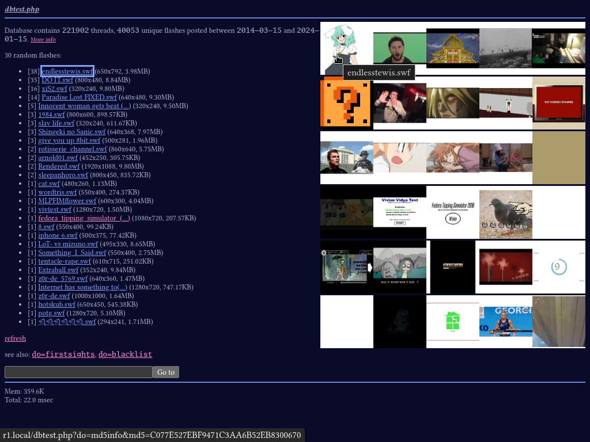
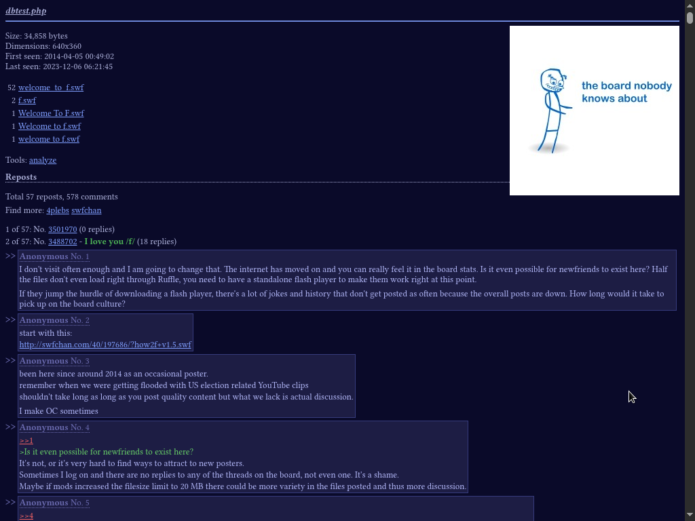
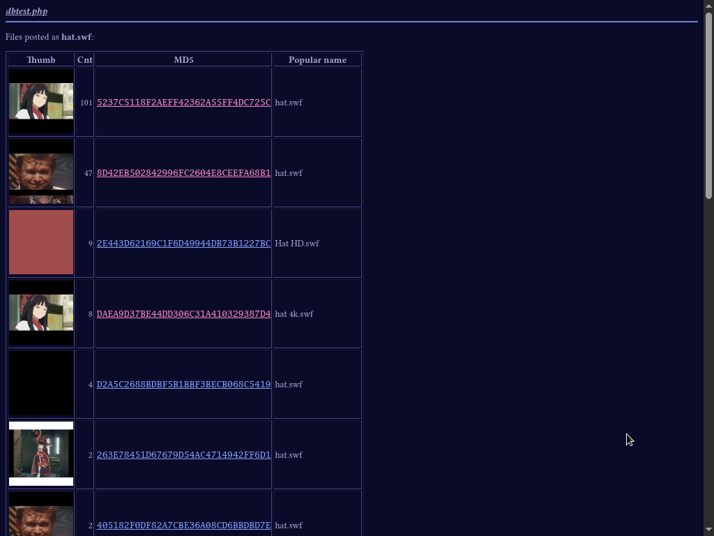
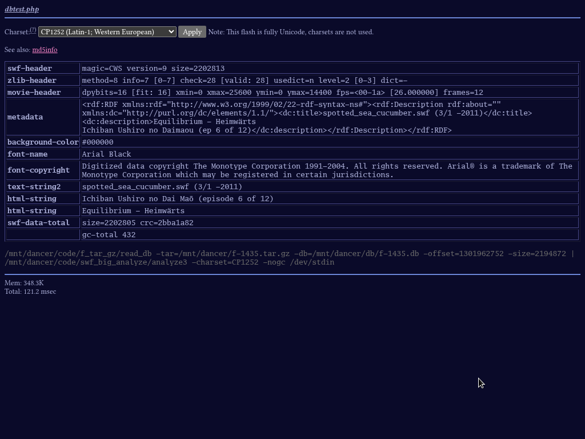

# dbtest_php

## about

php app i wrote to browse the 4plebs flash collection and have a place to learn
php sqlite in year 2023 anno domini

## screenshots

(had to refresh so many times to get a front page without porn)









## how to run

uh, if you really want to

- create the post database with `4plebs_data_to_sqlite.py` in
  [this repo](https://github.com/necroflasher/f_stuff) (requires the /f/ csv
  from [here](https://archive.org/details/4plebs-org-data-dump-2024-01): show
  all -> `f.csv.tar.gz`)

- edit `dbtest/config.php` to set some paths, disable stuff you don't have

- set up a web server (like nginx) with php (and the php mbstring and sqlite extensions), then copy `dbtest.php` and `dbtest/` to the web root

### optional features

#### analyze

- download every file archive for /f/ from
  [here](https://archive.org/details/4plebs-org-image-dump-2024-01-part1) (show
  all -> `f-XXXX.tar.gz`. total 155 GiB, IA is slow so this might take a while)
- don't extract them, create a database for each archive with
  [f_tar_gz](https://github.com/necroflasher/f_tar_gz)
- compile [swf_big_analyze](https://github.com/necroflasher/swf_big_analyze)
- set the paths in `dbtest/config.php` and enable the feature

#### blacklist

- create this table in the database file:
  ```
   -- 0 = uncategorized
   -- 1 = don't promote this flash - hide it from appearing in randomized listings like the front page
   -- 2 = above + hide its thumbnail everywhere
   CREATE TABLE f_blacklist (
      md5   BLOB    PRIMARY KEY NOT NULL CHECK(LENGTH(md5)=16),
      level INTEGER             NOT NULL CHECK(level IN (0, 1, 2)) DEFAULT 0
   ) STRICT;
  ```
- add some rows (just an example):
   ```
   INSERT INTO f_blacklist (md5, level)
   VALUES
      (X'97C72879E733C63C83C3181076522CBC', 2), -- shockywocky.swf
      (X'6844493C452434FEECD56FD6B5F8F89F', 1); -- PonyPonyPony.swf
   ```
- enable the feature in `dbtest/config.php`

#### thumbs

- download the thumbnail dump from
  [here](https://archive.org/details/4plebs-org-thumbnail-dump-2024-01) (show
  all -> `f_thumbs.tar.gz`)
- extract it to a path accessible from the web server
- set the path in `dbtest/config.php` and enable the feature
